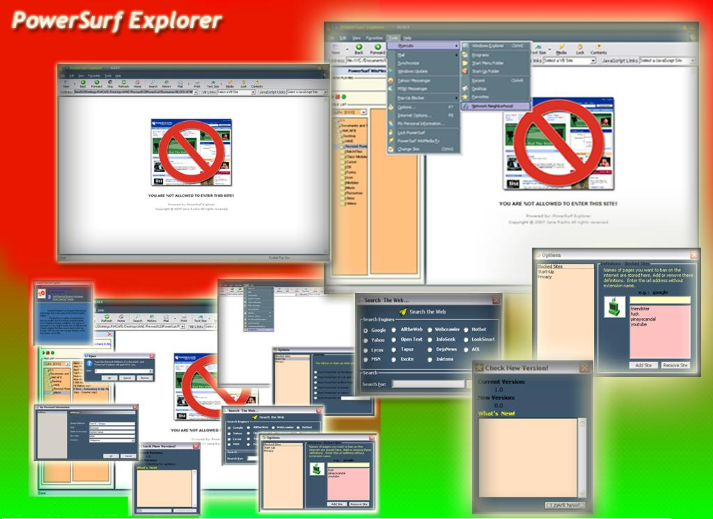



## PowerSurf Explorer

### Description

Information

----

Product:    PowerSurf Explorer

Version:    1.0

Web Site:   http://www.angelfire.com/planet/powersurf/index.html

Email:     keen_coder@yahoo.com

Introduction

----

PowerSurf Explorer is an IE based Web browser, which means that it uses some of the Internet Explorer Engine;  It incorporates a large collection of wonderful features like pop-up killer, filtering website or word, lock application, quick-search that allows you to search within the browser. It brings you convenient and comfortable browsing.

Some of Great Features:

----

Pop-Up Killer - allows you to Enable/Disable Pop-up Windows

Filtering - allows you to block all unwanted websites or word from accessing or viewing it,

specially those adult content sites.

Quick Search - Convenient access to major search engines..

Lock Application - block all unwanted users from accessing it while you were away from your PC.

Skins- allows you to change the skins according to your satisfaction.

WinMediaFx - you can play your favorite songs using the built-in Media Player.

Check New Version - ability to check for a new version of PowerSurf Explorer that has been released on the Internet.

Note From The Author:

-THanx to all PSCODE contributors..

-VB Smart Menu XP

Hope through this i code i can help you all.

----

For all controls and DLL is use...

Please download at :

http://www32.websamba.com/keencoder
 
### More Info
 

             |
---                |---
**Submitted On**   |2007-03-08 16:12:10
**By**             |[JaDe Software](https://github.com/Planet-Source-Code/PSCIndex/blob/master/ByAuthor/jade-software.md)
**Level**          |Intermediate
**User Rating**    |5.0 (25 globes from 5 users)
**Compatibility**  |VB 6\.0
**Category**       |[Internet/ HTML](https://github.com/Planet-Source-Code/PSCIndex/blob/master/ByCategory/internet-html__1-34.md)
**World**          |[Visual Basic](https://github.com/Planet-Source-Code/PSCIndex/blob/master/ByWorld/visual-basic.md)
**Archive File**   |[PowerSurf\_2052973102007\.zip](https://github.com/Planet-Source-Code/jade-software-powersurf-explorer__1-68105/archive/master.zip)

